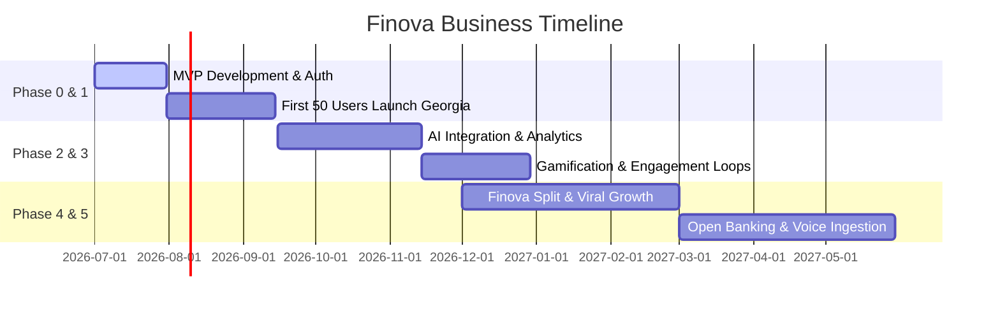

# Finova - Executive Business Roadmap

## Startup Development Phases

This roadmap guides the high-level business milestones of **Finova** as a product and company.

---

## Roadmap Phases

### Phase 0 — Foundation
* Branding design.
* Core design system implementation (Neo-Brutalism).
* Email/password authentication.
* PostgreSQL database initialization.
* Wallet setups (Cash, Bank of Georgia).

### Phase 1 — Expense & Income Tracking (MVP Target)
* Dynamic multi-currency tracking logic.
* Cash flow categories.
* Active budgeting tools and alerts.
* Core bottom navigation layout.
* Launch for target cohort: First 50 student users in Georgia.

### Phase 2 — AI Financial Coaching & Analytics
* Context-aware morning briefs and night summaries.
* Feasibility advisor chat ("Can I travel?").
* Multi-currency report views and filters.
* Financial health scoring logic (0-100 scale).

### Phase 3 — Habit Building (Gamification)
* XP rewards for budget preservation.
* Tracking streak loops and challenges.
* Localized badges and leaderboard systems.

### Phase 4 — Finova Split (Social Expansion)
* Peer-to-peer expense grouping.
* Split allocations (equally, custom, percentages).
* Simplification algorithm for settlement debt minimizations.

### Phase 5 — OCR Ingestion & Auto Bank Syncing
* AI-based receipt scanner OCR.
* Voice-driven transaction entry.
* Nordigen/GoCardless/Plaid bank statements sync.
