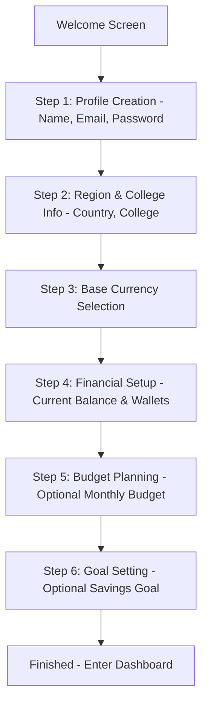

# Finova - Product Requirements Document (PRD)

## Version 1.1

---

## 1. Executive Summary & Vision

**Finova** is the AI Financial Operating System built specifically for students. It goes beyond simple expense tracking to help users understand their spending behaviors, build sustainable savings habits, make smarter day-to-day decisions, and reduce financial stress through AI-driven coaching, gamification, and automated budgeting.

### Mission Statement
Empower students worldwide to effortlessly track every transaction, understand their financial behavior, and save more through AI-powered coaching, automation, and engaging daily habits.

### North Star Metric
**Increase the amount of money students save while reducing financial stress through consistent daily financial habits.**

---

## 2. Core User Experience & Persona Mapping

### Target Audience
* **Primary**: International and local university/college students.
* **Secondary**: Young professionals and recent graduates.
* **Initial Launch Target**: First 50 students in Georgia (using GEL, USD, and multiple currencies like EUR/INR).

### Design Style & Philosophy
- **Style**: **Neo-Brutalism** (Bold typography, thick black borders, flat colors, rounded corners, soft white backgrounds, no glassmorphism, minimal/deliberate animations).
- **Mobile-First Constraints**:
  - Everything must be accessible within **3 taps**.
  - Expense/income logging must take **less than 5 seconds**.
  - Large touch targets (minimum 44x44px) placed in thumb-friendly navigation zones.
  - Offline-first capabilities for quick data entry.

---

## 3. Comprehensive User Onboarding Flow

To ensure high conversion and immediate personalization, onboarding is split into a multi-step modal/wizard flow:

### Onboarding Steps Detail:
1. **Profile Setup**: Capture name, email, and secure password.
2. **Contextual Settings**: Select country and college (crucial for local challenges, leaderboard, and currency detection).
3. **Preferred Currency**: Set base currency (e.g., USD, GEL, INR, EUR) used for unified reports.
4. **Primary Wallet**: Setup initial account (e.g., Cash or Bank of Georgia) and balance.
5. **Initial Monthly Budget (Optional)**: Set spending limit.
6. **Primary Savings Goal (Optional)**: Setup first goal (e.g., "Laptop", "Emergency Fund").

---

## 4. Feature Specifications

### 4.1 Wallet & Transaction System
- **Wallets**: Supports unlimited wallets. Custom categorization: Cash, Bank Accounts, Debit Cards, Credit Cards, Digital Wallets.
- **Transactions**:
  - **Types**: Income, Expense, Transfer (between wallets).
  - **Metadata**: Category, Date/Time, Wallet, Merchant, Notes, Attachments (receipt image, PDF), Currency.
- **Category Taxonomy**:
  - *Income*: Salary, Scholarship, Pocket Money, Freelancing, Gifts, Refunds, Other.
  - *Expense*: Food, Groceries, Coffee, Shopping, Rent, Transport (Metro, Taxi), Entertainment, Education, Medical, Utilities, Travel, Other.

### 4.2 Multi-Currency Engine
Each transaction record must store:
1. `originalAmount`: Amount entered by user.
2. `originalCurrency`: Currency selected for transaction (USD, INR, EUR, GBP, GEL, etc.).
3. `exchangeRate`: Conversion multiplier relative to the base currency on transaction date.
4. `convertedAmount`: Calculated amount in base currency (`originalAmount * exchangeRate`).
5. `exchangeDate`: Date of conversion.
- Reports must allow real-time toggling of currency view by recalculating aggregates using archived rates.

### 4.3 Budgeting & Daily Safe Spending
- **Budget Metrics**: Monthly Budget, Category Budgets, Weekly Budget.
- **Daily Safe Spending (DSS)**:
  - Dynamically calculated as:
    $$\text{DSS} = \frac{\text{Remaining Monthly Budget} - \text{Planned Savings}}{\text{Days Remaining in Month}}$$
  - Updates in real-time as transactions are recorded.
- **Budget Alerts**: Multi-channel alerts (50%, 80%, 100% budget utilization).

### 4.4 Savings Goals
- **Metrics**: Goal Name, Target Amount, Target Date, Current Saved, Associated Wallet (optional).
- **AI Analytics**: Calculates estimated completion date, monthly saving required to meet target, and "Goal Health" (On Track, Behind, Critical).

### 4.5 AI Coach & Chat
- **Daily Briefing**:
  - *Morning Brief*: Welcome, current balance, remaining budget, days remaining, Today's Quest, potential savings tip.
  - *Night Summary*: Summary of today's spending, budget utilization, XP earned, micro-optimizations.
- **AI Chatbot**: Context-aware queries ("Can I afford to order pizza tonight?", "Will I have enough rent money if I travel this weekend?").
- **AI Gateway**: Connects backend to Groq (Llama-3 models) with a fallback to OpenAI/Claude. Implements request queuing, response caching, and prompt template management.

### 4.6 Gamification System
- **Streaks**: Tracks consecutive days tracking expenses/checking budget.
- **XP (Experience Points)**: Earned through logging transactions, staying under DSS, completing challenges.
- **Challenges**:
  - *Daily/Weekly Quests*: "Use Metro Today", "No Coffee Challenge", "Cook At Home", "Stay Under Budget".
- **Leaderboard**: Ranks users by XP, Streak, and Challenge Completion (specifically excluding bank balances to maintain a friendly, non-exclusionary environment).

### 4.7 Finova Split (Expense Sharing)
- **Features**: Group creation, split equally, split by percentage, custom splits.
- **Settlement Engine**: Calculates minimum debt routes between friends to minimize transactions (e.g., "A owes B $10, B owes C $10" simplified to "A owes C $10").
- **AI Insights**: Shared expenses trends, warnings about unequal contributions.

---

## 5. Non-Functional & Security Requirements

- **Latency**: Expense logging must render instantly (offline validation); sync to server must take <1s.
- **Security**: Data encryption at rest and in transit. OAuth-ready tokens (JWT). Compliance with local data storage regulations.
- **Reliability**: Caching using Redis to ensure fast retrieval of daily stats and exchange rates.
