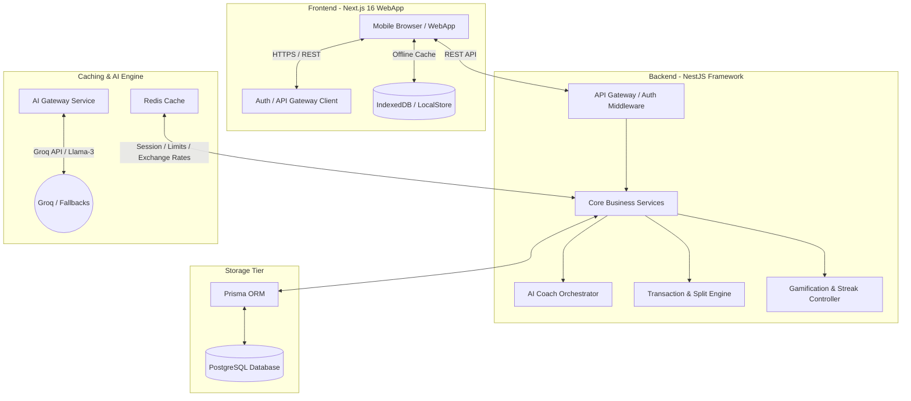
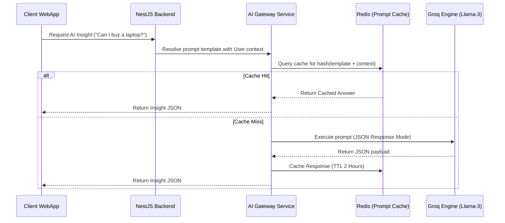

# Finova - System Architecture Design

## Version 1.0

---

## 1. System Overview

Finova is structured as a decoupled multi-tier architecture designed to be mobile-first, offline-friendly, and computationally optimized for real-time AI feedback.

---

## 2. Technology Stack & Component Breakdown

### 2.1 Frontend Tier (Next.js 16 & React)
- **Framework**: Next.js 16 utilizing the App Router directory structure for routing, static page rendering, and server actions (when appropriate).
- **Language**: TypeScript for type-safety across payloads and states.
- **Styling**: Tailwind CSS configured with custom utility overrides to conform to the **Neo-Brutalism** design system rules.
- **UI Components**: `shadcn/ui` custom styling bindings (adding thick borders, heavy shadows, sharp edges instead of gradients/glassmorphism).
- **Animations**: Framer Motion used sparingly for simple micro-interactions (adding/removing transactions, tab switches, badge unlocks).

### 2.2 Backend Tier (NestJS)
- **Framework**: NestJS (Node.js) structured with modular architectures (e.g., `UsersModule`, `TransactionsModule`, `BudgetsModule`, `GoalsModule`, `AiCoachModule`, `GamificationModule`, `SplitModule`).
- **Language**: TypeScript for shared interface definitions with the client.
- **Authentication**: JWT-based stateless authentication (stored securely on the client in HTTP-only cookies).
- **Task Scheduling**: `@nestjs/schedule` for automated cron jobs:
  - **Morning Brief Queueing**: Fires at 07:00 local time per user timezone.
  - **Night Summary Queueing**: Fires at 22:00 local time.
  - **Exchange Rate Refresh**: Daily fetch and update of exchange rates against USD.

### 2.3 Database & Storage Tier (PostgreSQL & Prisma)
- **Database**: PostgreSQL (hosted on Supabase or Neon) storing relational application data.
- **ORM**: Prisma ORM for database migrations, model schemas, and type-safe query building.
- **Storage**: Supabase Storage / Cloudflare R2 for storing transaction attachment files (receipts, PDFs).

### 2.4 Caching & Session Store (Redis)
- **Engine**: Redis (hosted on Upstash/Railway).
- **Usage**:
  - Caching of daily currency exchange rates to avoid redundant external API calls.
  - Tracking API rate limiting (particularly for AI endpoints).
  - Caching user streaks and active session states to optimize database queries.

---

## 3. AI Orchestration & Gateway Design

To maximize response speeds and minimize costs, Finova uses an **AI Gateway** abstraction layer within the NestJS backend:

### Prompt Engineering Guidelines
- **System Constraints**: Prompts must enforce the system personality: concise, student-friendly, highly motivational, and numbers-focused.
- **Response Format**: Strictly JSON to ensure the backend can cleanly parse recommendations and display them as UI cards instead of generic raw text blocks.

---

## 4. Multi-Currency Operations

Because Finova caters to international students, the system calculates all conversions dynamically:

1. **Transaction Entry**: User enters currency `C_tr` and amount `A_tr`.
2. **Rate Lookup**: System fetches current exchange rate `R` for `C_tr` to Base Currency `C_base` (e.g., GEL to USD).
3. **Storage**:
   - `originalAmount = A_tr`
   - `originalCurrency = C_tr`
   - `exchangeRate = R`
   - `convertedAmount = A_tr * R`
   - `baseCurrency = C_base`
4. **Aggregation**: Reports are compiled by summing up `convertedAmount` fields, allowing instantaneous report currency switches by multiplying the final sum by the selected currency's latest exchange rate.
