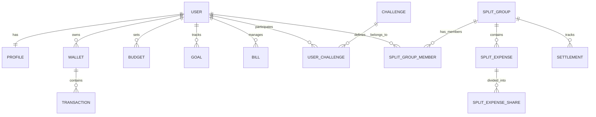

# Finova - Database Schema Design (Prisma)

## Version 1.0

This document defines the schema models, fields, types, enums, relations, and indices designed for PostgreSQL using Prisma ORM.

---

## 1. Schema Diagram Overview



---

## 2. Enums Definitions

```prisma
enum WalletType {
  CASH
  BANK_ACCOUNT
  DEBIT_CARD
  CREDIT_CARD
  DIGITAL_WALLET
}

enum TransactionType {
  INCOME
  EXPENSE
  TRANSFER
}

enum GoalHealth {
  ON_TRACK
  BEHIND
  CRITICAL
}

enum BillRecurrence {
  ONCE
  WEEKLY
  MONTHLY
  YEARLY
}

enum ChallengeStatus {
  IN_PROGRESS
  COMPLETED
  FAILED
}

enum SettlementStatus {
  PENDING
  SETTLED
}
```

---

## 3. Data Models (Prisma Syntax)

### 3.1 Core Authentication & User Models

```prisma
model User {
  id             String         @id @default(uuid())
  email          String         @unique
  passwordHash   String
  name           String
  country        String
  college        String
  baseCurrency   String         @default("USD")
  monthlyBudget  Float?         // Optional monthly budget cap
  currentBalance Float          @default(0.0)
  createdAt      DateTime       @default(now())
  updatedAt      DateTime       @updatedAt
  
  profile        Profile?
  wallets        Wallet[]
  budgets        Budget[]
  goals          Goal[]
  bills          Bill[]
  challenges     UserChallenge[]
  memberships    SplitGroupMember[]
  conversations  AIConversation[]
  splitsPaid     SplitExpense[] @relation("PaidBy")
}

model Profile {
  id             String         @id @default(uuid())
  userId         String         @unique
  user           User           @relation(fields: [userId], references: [id], onDelete: Cascade)
  
  xp             Int            @default(0)
  currentStreak  Int            @default(0)
  highestStreak  Int            @default(0)
  lastActiveDate DateTime?      // Tracks streaks
  badges         String[]       // Array of unlocked badge IDs
}
```

### 3.2 Wallet & Transaction Models

```prisma
model Wallet {
  id             String         @id @default(uuid())
  userId         String
  user           User           @relation(fields: [userId], references: [id], onDelete: Cascade)
  
  name           String
  type           WalletType     @default(CASH)
  balance        Float          @default(0.0)
  currency       String         @default("USD")
  createdAt      DateTime       @default(now())
  updatedAt      DateTime       @updatedAt
  
  transactions   Transaction[]
  
  @@index([userId])
}

model Transaction {
  id               String          @id @default(uuid())
  walletId         String
  wallet           Wallet          @relation(fields: [walletId], references: [id], onDelete: Cascade)
  
  amount           Float           // Original amount entered
  currency         String          // Original currency code (e.g. GEL, EUR)
  convertedAmount  Float           // Converted amount in Base Currency
  exchangeRate     Float           // Rate on conversion date
  exchangeDate     DateTime        @default(now())
  
  category         String          // Transaction category (e.g. Food, Salary)
  type             TransactionType
  notes            String?
  merchant         String?
  attachmentUrl    String?         // Receipt image/PDF link
  date             DateTime        @default(now())
  
  // Destination wallet ID if transaction is a TRANSFER
  transferWalletId String?         
  
  createdAt        DateTime        @default(now())
  
  @@index([walletId])
  @@index([date])
}
```

### 3.3 Budgets & Goals Models

```prisma
model Budget {
  id         String   @id @default(uuid())
  userId     String
  user       User     @relation(fields: [userId], references: [id], onDelete: Cascade)
  
  amount     Float
  currency   String
  category   String   // "ALL" for overall monthly budget, or specific category
  isWeekly   Boolean  @default(false)
  startDate  DateTime
  endDate    DateTime
  
  createdAt  DateTime @default(now())
  
  @@index([userId])
}

model Goal {
  id                  String     @id @default(uuid())
  userId              String
  user                User       @relation(fields: [userId], references: [id], onDelete: Cascade)
  
  name                String
  targetAmount        Float
  currentSaved        Float      @default(0.0)
  targetDate          DateTime
  health              GoalHealth @default(ON_TRACK)
  
  // Calculated properties saved from AI routine
  estimatedCompletion DateTime?
  monthlyRequired     Float      @default(0.0)
  
  createdAt           DateTime   @default(now())
  updatedAt           DateTime   @updatedAt
  
  @@index([userId])
}

model Bill {
  id         String         @id @default(uuid())
  userId     String
  user       User           @relation(fields: [userId], references: [id], onDelete: Cascade)
  
  name       String
  amount     Float
  currency   String
  dueDate    DateTime
  isPaid     Boolean        @default(false)
  recurrence BillRecurrence @default(MONTHLY)
  category   String
  
  createdAt  DateTime       @default(now())
  
  @@index([userId])
}
```

### 3.4 Gamification Models

```prisma
model Challenge {
  id          String          @id @default(uuid())
  name        String
  description String
  xpReward    Int             @default(50)
  isWeekly    Boolean         @default(false)
  
  users       UserChallenge[]
}

model UserChallenge {
  id          String          @id @default(uuid())
  userId      String
  user        User            @relation(fields: [userId], references: [id], onDelete: Cascade)
  challengeId String
  challenge   Challenge       @relation(fields: [challengeId], references: [id], onDelete: Cascade)
  
  status      ChallengeStatus @default(IN_PROGRESS)
  progress    Float           @default(0.0) // percentage complete (0.0 to 1.0)
  completedAt DateTime?
  
  createdAt   DateTime        @default(now())
  
  @@unique([userId, challengeId])
}
```

### 3.5 Finova Split Models

```prisma
model SplitGroup {
  id        String             @id @default(uuid())
  name      String
  createdAt DateTime           @default(now())
  
  members   SplitGroupMember[]
  expenses  SplitExpense[]
  settlements Settlement[]
}

model SplitGroupMember {
  id           String     @id @default(uuid())
  groupId      String
  group        SplitGroup @relation(fields: [groupId], references: [id], onDelete: Cascade)
  userId       String
  user         User       @relation(fields: [userId], references: [id], onDelete: Cascade)
  
  joinedAt     DateTime   @default(now())
  
  @@unique([groupId, userId])
}

model SplitExpense {
  id          String              @id @default(uuid())
  groupId     String
  group       SplitGroup          @relation(fields: [groupId], references: [id], onDelete: Cascade)
  
  description String
  amount      Float
  currency    String
  paidById    String
  paidBy      User                @relation("PaidBy", fields: [paidById], references: [id])
  date        DateTime            @default(now())
  
  shares      SplitExpenseShare[]
  
  @@index([groupId])
}

model SplitExpenseShare {
  id             String       @id @default(uuid())
  splitExpenseId String
  expense        SplitExpense @relation(fields: [splitExpenseId], references: [id], onDelete: Cascade)
  
  userId         String
  amount         Float        // Member's share in original currency
  percentage     Float        // Share percentage
}

model Settlement {
  id        String           @id @default(uuid())
  groupId   String
  group     SplitGroup       @relation(fields: [groupId], references: [id], onDelete: Cascade)
  
  payerId   String           // User who owes
  payeeId   String           // User owed to
  amount    Float
  currency  String
  status    SettlementStatus @default(PENDING)
  date      DateTime         @default(now())
  
  @@index([groupId])
}
```

### 3.6 AI Conversation Log Model

```prisma
model AIConversation {
  id        String   @id @default(uuid())
  userId    String
  user      User     @relation(fields: [userId], references: [id], onDelete: Cascade)
  
  prompt    String
  response  String
  createdAt DateTime @default(now())
  
  @@index([userId])
}
```
